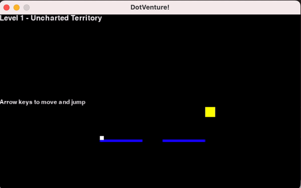

# BlockVenture
A block-adventure platform game using realtime physics to mimic level-based monsters and players.




### Technologies

- Built in Python with [pygame](https://github.com/pygame/pygame)

### Usage

1. Clone the repository
   ```
   git clone https://github.com/rshah713/BlockVenture.git
   ```
2. [Install dependencies](https://www.pygame.org/wiki/GettingStarted#Pygame%20Installation)
   ```
   pip3 install pygame
   ```
3. Run from Python interpreter:
  ```bash
  python3 main.py
  ```
